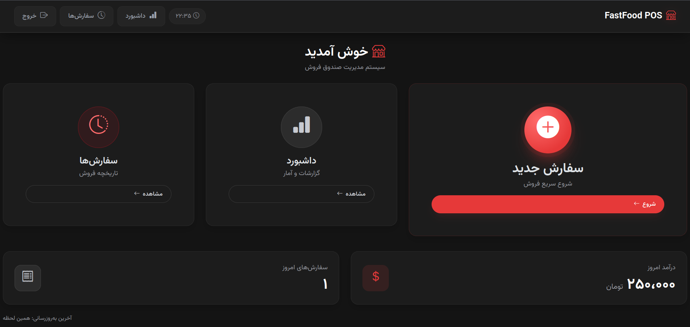
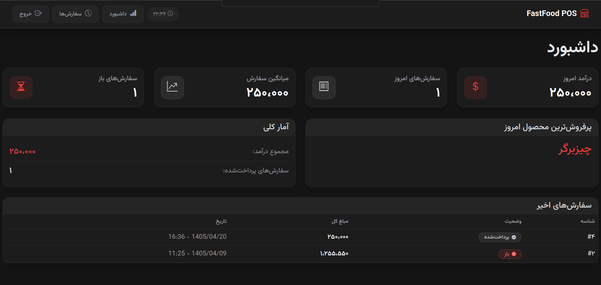

# Burger POS

A simple point-of-sale (POS) system built with Django for cashiers to manage in-person food orders at a fast-food counter. This is **not** a customer-facing storefront — it's an internal tool used by staff to take orders, track order status, and view sales stats.

> ⚠️ This project is currently in development and not deployed to production.




## Features

- **Order management** — create a new order, add/remove items, adjust quantities, cancel or complete an order
- **Order lifecycle** — orders move through `draft → open → paid` (or `cancelled`)
- **Order history** — paginated list of a cashier's past orders, with per-order receipts
- **Dashboard** (superuser only) — today's total sales, order count, average order value, best-selling product, and recent orders across all cashiers
- **Home screen stats** — quick view of today's total sales and order count for the logged-in user
- **Admin panel** — powered by [django-unfold](https://github.com/unfoldadmin/django-unfold) for a modern admin UI
- **Localization** — interface in Persian (Farsi), with `Asia/Tehran` as the default timezone

## Tech Stack

- **Backend:** Django
- **Database:** PostgreSQL
- **Admin UI:** django-unfold
- **Auth:** Custom user model (`accounts.CustomUser`)
- **Containerization:** Docker & Docker Compose

## Project Structure

```
core/       # Django project settings, root URL config
accounts/   # Custom user model / authentication
menu/       # Products, orders, order items, views
```

## Data Model

- **Product** — name, price, active flag, optional image
- **Order** — belongs to a user (cashier), has a status and total price
- **OrderItem** — links an order to a product with quantity and unit price at time of sale

## Getting Started

### Option 1: Docker (recommended)

**Prerequisites:** Docker and Docker Compose

1. Clone the repository
   ```bash
   git clone https://github.com/Mohhamadaminn/fastfood_POS
   cd fastfood_POS
   ```

2. Create a `.env` file in the project root
   ```
   SECRET_KEY=your-secret-key
   DEBUG=True
   ALLOWED_HOSTS=localhost,127.0.0.1
   POSTGRES_DB=burgerpos
   POSTGRES_USER=postgres
   POSTGRES_PASSWORD=your-password
   ```

3. Build and start the containers
   ```bash
   docker compose up --build
   ```

   This starts a PostgreSQL container (`db`) and the Django app (`web`). The `web` container waits for the database to be healthy, then automatically runs migrations on startup.

4. Create a superuser (in a separate terminal, while the containers are running)
   ```bash
   docker compose exec web python manage.py createsuperuser
   ```

The app will be available at `http://127.0.0.1:8000/`, and the admin panel at `http://127.0.0.1:8000/admin/`.

### Option 2: Manual setup (without Docker)

**Prerequisites:** Python 3.12+, PostgreSQL

1. Clone the repository
   ```bash
   git clone https://github.com/Mohhamadaminn/fastfood_POS
   cd fastfood_POS
   ```

2. Create and activate a virtual environment
   ```bash
   python -m venv venv
   source venv/bin/activate  # Windows: venv\Scripts\activate
   ```

3. Install dependencies
   ```bash
   pip install -r requirements.txt
   ```

4. Set environment variables (e.g. in a `.env` file or your shell)
   ```
   SECRET_KEY=your-secret-key
   DEBUG=True
   ALLOWED_HOSTS=localhost,127.0.0.1
   POSTGRES_DB=burgerpos
   POSTGRES_USER=postgres
   POSTGRES_PASSWORD=your-password
   POSTGRES_HOST=localhost
   POSTGRES_PORT=5432
   ```

5. Run migrations and create a superuser
   ```bash
   python manage.py migrate
   python manage.py createsuperuser
   ```

6. Start the development server
   ```bash
   python manage.py runserver
   ```

The app will be available at `http://127.0.0.1:8000/`, and the admin panel at `http://127.0.0.1:8000/admin/`.

## Notes

- No real payment gateway is integrated — "Complete Order" simply marks an order as paid.
- The dashboard view is restricted to superusers only.
